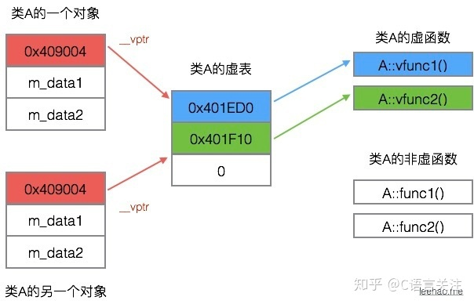

# c++引用


引用就是某一变量（目标）的一个别名，对引用的操作与对变量直接操作完全一样。

其格式为：类型 &引用变量名 = 已定义过的变量名。

引用的特点：

①一个变量可取多个别名。

②引用必须初始化。

③引用只能在初始化的时候引用一次 ，不能更改为转而引用其他变量。

int& c = b;


const引用，不能给它赋值。

只有const 引用可以引用常量。

const int & d6 = 5;


引用做参数：

【引用传递】如果形参为引用类型，则形参是实参的别名，函数中的操作改变引用。


### C++和C的区别

C++是面向对象，C是面向过程。C++具有封装、继承、多态三种特性。C++增加了许多类型安全的功能，比如强制类型转换。还有智能指针


# C++封装、继承、多态


#### 多态：

可以简单地概括为“一个接口，多种方法”

多态性指相同对象收到不同消息或不同对象收到相同消息时产生不同的实现动作。C++支持两种多态性：编译时多态性，运行时多态性。

##### 编译时多态性（静态多态）：

编译器根据函数实参的类型(可能会进行隐式类型转换)，可推断出要调用那个函数，如果有对应的函数就调用该函数，否则出现编译错误。

通过**重载函数**实现

​		C++中通过上下文来确定同名函数的重载版本。**重载函数**的关键是函数参数列表——也称函数特征标。

​		**函数模板**是通用的函数描述，也就是说，使用泛型来定义函数，其中泛型可用具体的类型（int 、double等）替换。通过将类型作为参数，传递给模板，可使编译器生成该类型的函数。


##### 运行时多态性（动态多态）：

在程序执行期间(非编译期)判断所引用对象的实际类型，根据其实际类型调用相应的方法

通过虚函数实现 ：滞后联编 late binding

动态绑定:

对象的类型有：
		静态类型：对象声明时的类型，编译时确定
		动态类型：目前所指对象的类型，运行时确定


虚函数：

```
class Base
{   
public :
    virtual void FunTest1( int _iTest){cout <<"Base::FunTest1()" << endl;}
};
class Derived : public Base
{
public :
    void FunTest1( int _iTest){cout <<"Derived ::FunTest1()" << endl;}
}
```


##### 虚函数表

对于有虚函数的类，编译器都会维护一张虚函数表(虚表)，对象的前四个字节就是指向虚表的指针(虚表指针)。




什么时候会执行函数的动态绑定？这需要符合以下三个条件。

- 通过指针来调用函数
- 指针upcast向上转型（继承类向基类的转换称为upcast，关于什么是upcast，可以参考本文的参考资料）
- 调用的是虚函数

指针指向具体对象，对象有虚函数指针，指向具体类的虚表，指针调用虚函数时调用了该具体类的虚函数。


#### 继承

public 继承，保持基类的共有性和私有性

private继承，基类的共有类在子类中变私有


基类中，protected对象对外私有，对子类可访问；


# C++类的存储及类对象内存结构

数据成员存在对象的内存中，函数成员不保存在对象中，相当于一般函数的存储。

一个对象调用函数的时候，可以等价为普通函数的调用
a.f()等价于调用f(&a);类中的成员函数（static 成员函数除外）形参中都有个隐含的this
指针，它指向类对象本身。
当对象 a 调用f()的时候，它会把a 的地址传给this 指针。


### 内存泄漏

**什么是内存泄露？**

简单地说就是申请了一块内存空间，使用完毕后没有释放掉。

（1）new和malloc申请资源使用后，没有用delete和free释放；
（2）子类继承父类时，父类析构函数不是虚函数。
（3）Windows句柄资源使用后没有释放。

malloc是在**堆上分配内存**，需要程序员自己回收内存；局部变量是在**栈中分配内存**，超过作用域就自动回收。


# STL


#### 容器

1.顺序容器

​	vector, deque, list

2.关联式容器

​	元素排序，有较好的查找性能。一般为平衡二叉树

​	set

​	map：map中的元素有2个成员变量，根据key值对元素排序


 map、hashtable、deque、list实现机理分别为红黑树、函数映射、双向队列、双向链表


#### STL 的空间配置器（allocator）

##### 在c++中，创建类对象一般分为两种方式：

一种是直接利用构造函数,直接构造类对象，如 Test test()；
另一种是通过new来实例化一个类对象，如 Test *pTest = new Test；
那么，这两种方式有什么异同点呢？


直接调用类构造函数，如果是局部变量，在栈空间中
如果是全局变量，静态变量，在静态存储区分配
new对象，首先在堆空间分配内存，然后调用构造函数构造内容；delete时，先调用析构函数，再释放堆中内存。


##### C++ STL空间配置器实现


# Static关键字

##### 静态全局变量：

​		限制其在整个文件中可见，外部不可见；
​		在全局数据区分配内存；

##### 静态局部变量：

​		只能在声明该变量的函数内可见，其他作用域不可见；
​		在全局数据区分配内存；
​		在执行到对象时，首次初始化，函数结束后不会回收内存，下一次也不会初始化；

##### 静态数据成员：

​		静态数据成员的服务对象是所有类实例化的对象；
​		静态数据成员必须显示的初始化分配内存,在其包含类没有任何实例花之前,其已经有内存分配；
​		静态数据成员内存存储在全局数据区,只随着进程的消亡而消亡；
​		静态数据成员不进入程序全局名字空间,不会与其他全局名称的同名同类型变量冲突；

##### 静态成员函数：

​		可以直接通过类调用，不用对象；
​		静态成员函数中没有隐含的this指针,所以静态成员函数不可以操作类中的非静态成员；
