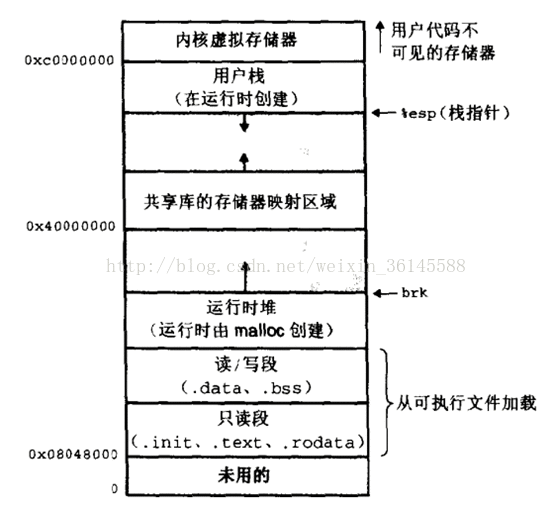
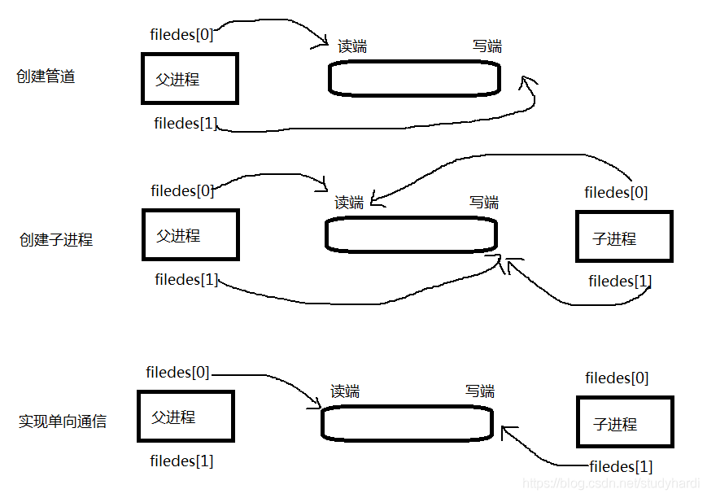

# 进程的内存分布



一般认为在c中分为这几个存储区：
       1. 栈 －－有编译器自动分配释放 
       2. 堆 －－ 一般由程序员分配释放，若程序员不释放，程序结束时可能由OS回收 
       3. 全局区静态区—— 全局变量和静态变量的存储是放在一块的（.data），初始化的全局变量和静态变量在一 块区域，未初始化的全局变量（.bss）
       4. 常量区——另外还有一个专门放常量的地方(常量区)。程序结束释放。
       5. 程序代码区 ——  .text代码段


Linux在启动过程中，要首先进行内存的初始化，那么就一定要首先创建页表。我们知道每个进程都拥有各自的进程空间，而每个进程空间又分为内核空间和用户空间。
以arm32为例，每个进程有4G的虚拟空间，其中0-3G属于用户地址空间，3G-4G属于内核地址空间，内核地址空间是所有进程共享的，因此内核地址空间的页表也是所有进程共享的。


虚拟地址可通过每个进程上的页表(在每个进程的内核虚拟地址空间)与物理地址进行映射，获得真正物理地址； 


### 堆与栈的区别

栈小，在函数调用，传递参数时会用到栈；
堆大，在new,malloc时分配堆的内存；

分配大于128K的内存时，调用malloc()，用空闲链表法，找到合适的内存块。

分配内存先分配虚拟内存，当要访问该地址时，再缺页处理，分配物理内存。


### 用户栈，内核栈

​		当进程由于中断或系统调用从用户态转换为内核态时，进程所使用的栈也要从用户栈切换到内核栈。系统调用实质就是通过指令产生中断（软中断）。进程由于中断而陷入到内核态，进程进入内核态之后，首先把用户态的堆栈地址保存在内核态堆栈中，然后设置堆栈寄存器地址为内核栈地址，这样就从用户栈转换成内核栈。
​		当进程从内核态转换到用户态时，将堆栈寄存器的地址再重新设置成用户态的堆栈地址（即终端前进程在用户态执行的位置），这一过程也成为现场恢复


# 线程

### 线程内存分布

不同线程有自己私有的用户态栈，但共享进程的运行时堆。
（共享父进程的地址空间，再在里面分配自己的独立栈，默认2M）
每个线程需要一个单独的内核栈。

线程的栈可以存放其运行状态和局部自动变量、临时变量，生命周期随线程。栈是thread safe的。操作系统在切换线程的时候会自动的切换栈，就是切换SS/ESP寄存器。

堆分全局堆和局部堆。全局堆就是所有没有分配的空间，局部堆就是用户分配的空间。堆在操作系统对进程初始化的时候分配，运行过程中也可以向系统要额外的堆，但是记得用完了要还给操作系统，要不然就是内存泄漏。
不同线程在堆中创建的内存空间是可以被其他线程访问的。
一般不建议在线程中用new开辟新内存空间，因为heap是共享的，所以一个线程在用new的时候别的所有线程都得停下来等，这样就有很大的同步代价. 


### 创建线程的过程

每一个线程都有一个pthread结构，放在线程栈底；
创建线程栈，在进程的堆里面malloc一块内存创建。
填充pthread结构里的变量。


### 进程与线程的区别

进程有独立的地址空间，内存。线程共享进程的。。。

#### 开销区别

Linux 中创建一个进程自然会创建一个线程，也就是主线程。创建进程需要为进程划分出一块完整的内存空间，有大量的初始化操作，比如要把内存分段（堆栈、正文区等）。

创建线程则简单得多，只需要确定 PC 指针和寄存器的值，并且给线程分配一个栈用于执行程序，同一个进程的多个线程间可以复用堆栈。因此，创建进程比创建线程慢，而且进程的内存开销更大。

线程只分配了计算资源，进程分配了内存资源、文件资源


# 内核态和用户态的划分与切换

内核态：cpu可以访问内存的所有数据，包括外围设备，例如硬盘，网卡，cpu也可以将自己从一个程序切换到另一个程序。

用户态：只能受限的访问内存，且不允许访问外围设备，占用cpu的能力被剥夺，cpu资源可以被其他程序获取。

所有用户程序都是运行在用户态的, 但是有时候程序确实需要做一些内核态的事情, 例如从硬盘读取数据, 或者从键盘获取输入等. 而唯一可以做这些事情的就是操作系统, 所以此时程序就需要先操作系统请求以程序的名义来执行这些操作.

##### 这种机制叫系统调用, 在CPU中的实现称之为陷阱指令(Trap Instruction)

他们的工作流程如下:

1. 用户态程序将一些数据值放在寄存器中, 或者使用参数创建一个堆栈(stack frame), 以此表明需要操作系统提供的服务.
2. 用户态程序执行陷阱指令
3. CPU切换到内核态, 并跳到位于内存指定位置的指令, 这些指令是操作系统的一部分, 他们具有内存保护, 不可被用户态程序访问
4. 这些指令称之为陷阱(trap)或者系统调用处理器(system call handler). 他们会读取程序放入内存的数据参数, 并执行程序请求的服务
5. 系统调用完成后, 操作系统会重置CPU为用户态并返回系统调用的结果


# 虚拟地址怎么映射到物理地址

每个进程有操作系统分配的内存，一级页表的基地址。切换到某个进程时，会用到它的基地址。

通过二级页表访问物理地址。虚拟地址前12位用来在一级页表找到PTE页表的地址，中间8位找二级页表的条目，后12位为偏移。取PTE中的物理地址。


# 进程通信的各种方法

### 共享内存

[(95条消息) 共享内存-父子进程、非亲缘关系进程通信_suxusong的博客-CSDN博客_亲缘关系进程](https://blog.csdn.net/suxusong/article/details/107201768)

原理：两个进程中，两个不同的虚拟地址通过页表映射到物理空间的同一区域，它们所指向的这块区域即共享内存。

**共享内存的接口函数**

1. char ftok(const char *path, char key)

   path: 文件路径， key：一个字符
   根据唯一的文件编号产生唯一的一个号

   

2. shmget ( )：创建共享内存

   原型：`int shmget(key_t key, size_t size, int shmflg);`
   参数：

   ​			key: 由ftok生成的key标识，标识系统的唯一IPC资源。
   ​			size: 需要申请共享内存的大小。一般申请的内存大小为页的整数倍。
   ​			shmflg如果要创建新的共享内存，需要使用IPC_CREAT，IPC_EXCL，如果是已经存在的，可以使用IPC_CREAT或直接传0。

   返回：

   ​			成功时返回一个新建或已经存在的的共享内存标识符，取决于shmflg的参数。

   ​			失败返回-1并设置错误码。

   

3. shmat函数： 创建了共享内存后需要将内存映射到用户空间，减少内核访问。
   原型：`void *shmat(int shmid, const void *shmaddr, int shmflg)` //类似于malloc
   参数： 第一个参数，ID号
       第二个参数，映射到的地址，NULL为系统自动完成的映射
       第三个参数，shmflg， SHM_RDONLY共享内存只读
             默认是0，表示可读写
   返回： 成功映射后的地址
      失败NULL


4. shmdt函数： 删除进程中的地址映射
   原型： int shmdt(const void *shmaddr)
   参数： shmaddr共享内存映射后的地址
   返回： 成功0，出错-1


（1）优点：我们可以看到使用共享内存进行进程之间的通信是非常方便的，而且函数的接口也比较简单，数据的共享还使进程间的数据不用传送，而是直接访问内存，加快了程序的效率。

（2）缺点：共享内存没有提供同步机制，这使得我们在使用共享内存进行进程之间的通信时，往往需要借助其他手段来保证进程之间的同步工作。


### 信号量

进程间获取同一信号量的低层操作和共享内存相似。ftok()

信号量本质上是一个计数器，信号量只能进行两种操作等待和发送信号，即P(sv)和V(sv),信号量进行PV操作时都为原子操作

进程如何获得共享资源：
（1）测试控制该资源的信号量

（2）信号量的值为正，进程获得该资源的使用权，进程将信号量减1，表示它使用了一个资源单位

（3）若此时信号量的值为0，则进程进入挂起状态（进程状态改变），直到信号量的值大于0，若进程被唤醒则返回至第一步。

注：信号量通过同步与互斥保证访问资源的一致性。


### 管道

某一时刻只能单一方向传递数据，不能双向传递数据，这种工作模式就叫做半双工模式。半双工工作模式的管道通信是只能从一端写数据，从另一端读数据。





### 消息队列

消息队列亦称报文队列，也叫做信箱。是Linux的一种通信机制，这种通信机制传递的数据具有某种结构，而不是简单的字节流。
消息队列的本质其实是一个内核提供的链表，内核基于这个链表，实现了一个数据结构


##### 1. 创建消息队列

通过msgget创建消息队列
函数原型如下

```text
int msgget(key_t key, int msgflg);
```

参数：
	key: 某个消息队列的名字
	msgflg:由九个权限标志构成，用法和创建文件时使用的mode模式标志是一样的，这里举两个来说明

返回值：
	成功msgget将返回一个非负整数，即该消息队列的标识码；
	失败则返回“-1”


##### 2. 添加信息到消息队列

向消息队列中添加数据，使用到的是msgsnd()函数
函数原型如下

```text
int  msgsnd(int msgid, const void *msg_ptr, size_t msg_sz, int msgflg);
```

参数：

​	msgid: 由msgget函数返回的消息队列标识码
​	msg_ptr:是一个指针，指针指向准备发送的消息，
​	msg_sz:是msg_ptr指向的消息长度，消息缓冲区结构体中mtext的大小,不包括数据的类型	msgflg:控制着当前消息队列满或到达系统上限时将要发生的事情

返回值：
	成功返回0
	失败则返回-1


##### 3. 从消息队列中读取消息

从消息队列中读取消息，我们使用msgrcv()函数，
函数原型如下

```text
int  msgrcv(int msgid, void *msg_ptr, size_t msgsz,
		 long int msgtype, int msgflg);
```