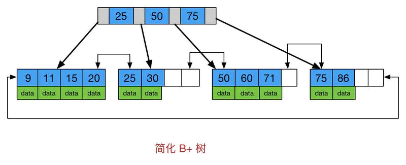
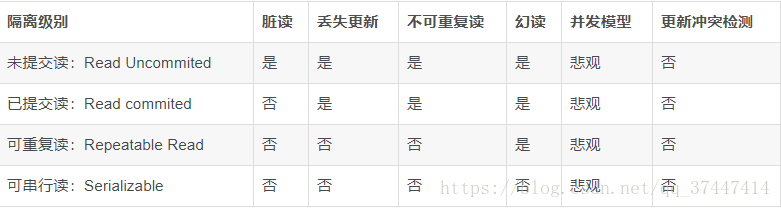
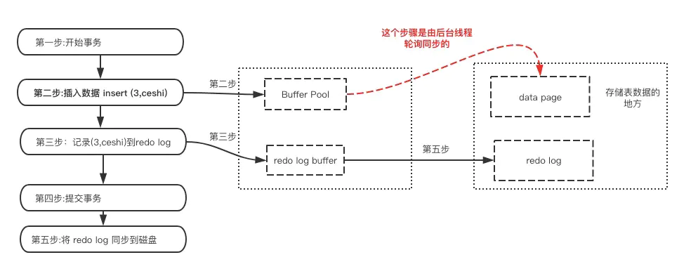

# 数据库设计三范式

1.列不可再分（列的原子性）
2.属性完全依赖于主键（每行必须被唯一的区分）
3.属性不依赖于其他非主属性

# B树，B+树

B树在中间节点的key值也存有data，所有键值分布在整颗树中

它对于读取和写入大块数据有良好的性能，所以一般被用在文件系统及数据库中。

新建节点时，直接申请页大小的空间（磁盘存储单位是按 block 分的，一般为 512 Byte。磁盘 IO 一次读取若干个 block，我们称为一页，具体大小和操作系统有关，一般为 4 k，8 k或 16 k），计算机内存分配是按页对齐的，这样就实现了一个节点只需要一次 IO。

好处：
		多叉树降低了树的高度，比二叉树深层搜索的速度更快；
		空间局部性良好。

所有关键字存储在叶子节点出现,内部节点(非叶子节点并不存储真正的 data)

为所有叶子结点增加了一个链指针

好处：
		增加了区间访问能力，可以利用叶节点的链指针访问下一节点
		由于内节点无 data 域，每个节点能索引的范围更大更精确

# 数据库事务

数据库的事务（Transaction）是一种机制、一个操作序列，包含了一组数据库操作命令。事务把所有的命令作为一个整体一起向系统提交或撤销操作请求，即这一组数据库命令要么都执行，要么都不执行，因此事务是一个不可分割的工作逻辑单元。

#### 事务的ACID特性

原子性：一组语句要么全执行，要么全不执行。

​				基于日志系统的redo,undo机制。

一致性：事务不会破坏数据库的完整性约束

隔离性：并发的不同的事务之间彼此没有任何干扰；

持久性：事务完成后，对数据库的改变是永久的

# 数据库隔离级别问题

## 事务之间相互影响的种类

##### 1.脏读

一个事务读取了另一个事务未提交的数据

##### 2.不可重复读

在一个事务范围内，两次相同的查询会返回两个不同的数据,是因为在此间隔内有其他事务对数据进行了修改。

##### 3.幻读

在一次事务里面，多次查询之后，结果集的个数不一致的情况叫做幻读。而多出来或者少的哪一行被叫做幻行。行锁只能锁住行，即使把所有的行记录都上锁，也阻止不了新插入的记录。 

##### 4.更新丢失

两个事务同时读取同一条记录，A先修改记录，B也修改记录（B是不知道A修改过），B提交数据后B的修改结果覆盖了A的修改结果。

## 锁机制

#### 悲观锁

**共享锁：**由读表操作加上的锁，加锁后其他用户只能获取该表或行的共享锁，不能获取排它锁，也就是说只能读不能写。

**排他锁：**由写表操作加上的锁，加锁后其他用户不能获取该表或行的任何锁，典型是mysql事务。

**表级锁、行级锁**

因此锁可以分为**表级共享锁**、**行级共享锁**、**表级排它锁**、**行级排它锁**。

#### 乐观锁

乐观锁，大多是基于数据版本号（ Version ）记录机制实现。何谓数据版本号？即为数据添加一个版本号标识，在基于数据库表的版本号解决方式中，通常是通过为数据库表添加一个 “version” 字段来实现。

读取出数据时，将此版本号号一同读出，之后更新时，对此版本号号加一。

此时。将提交数据的版本号数据与数据库表相应记录的当前版本号信息进行比对，假设提交的数据版本号号大于数据库表当前版本号号，则予以更新。否则觉得是过期数据。

## 事务隔离级别

sql server 隔离事务之间的影响是通过锁来实现的，通过阻塞来隔离上述影响，级别越高，加的锁越多，效率越地下。

**未提交读**:在读取数据时不会加任何锁，也不会进行检测，可能会读到没有提交的数据。

**已提交读**:只读取提交的数据等待其他事物释放排他锁，读数据的共享锁在读操作完成后会立即释放。这个隔离级别是大多数sql server默认的隔离级别。

**可重复读**:像已提交读一样，但共享锁会保持到事物结束才会释放。mysql默认。不能解决幻读，因为即使事务A对每条已经读过的数据加锁，其他事务不能修改，解决了可重复读，但其他事务可以insert新的行，造成事务A幻读。

**串行化**:该级别锁定整个范围的键。并一直持有锁，直到事务完毕。

# Innodb 引擎

## 事务的实现

#### 1.原子性实现原理

主要靠undo log实现，实现原子性的关键，是当事务回滚时能够撤销所有已经成功执行的sql语句。InnoDB实现回滚，靠的是undo log：当事务对数据库进行修改时，InnoDB会生成对应的undo log；如果事务执行失败或调用了rollback，导致事务需要回滚，便可以利用undo log中的信息将数据回滚到修改之前的样子。

undo log属于逻辑日志，它记录的是sql执行相关的信息。当发生回滚时，InnoDB会根据undo log的内容做与之前相反的工作

#### 2.持久性实现原理

为了提升性能InnoDB提供了缓冲池(Buffer Pool)，Buffer Pool中包含了磁盘数据页的映射，可以当做缓存来使用。但断电时会丢失数据，来不及持久化。

持久化主要靠redo log实现：在数据提交时写入磁盘

相比直接磁盘IO的好处：

（1）刷脏是随机IO，因为每次修改的数据位置随机，但写redo log是追加操作，属于顺序IO。

（2）刷脏是以数据页（Page）为单位的，MySQL默认页大小是16KB，一个Page上一个小修改都要整页写入；而redo log中只包含真正需要写入的部分，无效IO大大减少。

#### 3.隔离性

锁机制和MVCC

#### 4.一致性

实现一致性的措施包括：

- 保证原子性、持久性和隔离性，如果这些特性无法保证，事务的一致性也无法保证
- 数据库本身提供保障，例如不允许向整形列插入字符串值、字符串长度不能超过列的限制等
- 应用层面进行保障，例如如果转账操作只扣除转账者的余额，而没有增加接收者的余额，无论数据库实现的多么完美，也无法保证状态的一致

## Innodb 的默认加锁方式是什么，是怎么实现的

Innodb默认加锁方式是行级锁

通过给索引上的索引项加锁来实现的

## InnoDB数据页结构

页是InnoDB管理存储空间的基本单位，一个页的大小一般是16KB。

存储数据记录的页，官方称为索引页。

页中按照主键大小正序串联成了一个单链表。

因此mysql使用了Page Directory（页目录），来实现对主键的查找。：将所有记录分为几组，将各组的偏移量取出存在Page Directory。

1. **通过二分法确定该记录所在的槽，并找到该槽所在分组中主键值最小的那条记录。**
2. **通过记录的next_record属性遍历该槽所在的组中的各个记录。**

## B+树索引

B+树索引并不能找到一个给定键值的具体行。B+树索引能找到的只是被查找数据行所在的页。然后数据库通过把页读入到内存，再在内存中进行查找，最后得到要查找的数据。

聚集索引就是按照每张表的主键构造一颗B+树，同时叶子节点中存放的即为整张表的行记录数据，也将聚集索引的叶子节点称为数据页。

对于辅助索引，叶子节点并不包含行记录的全部数据。叶子节点除了包含键值以外，每个叶子节点中的索引行中还包含一个书签。该书签用来告诉InnoDB存储引擎哪里可以找到与索引相对应的行数据。

## MVCC在MySQL的InnoDB中的实现

在InnoDB中，每条记录都包含了一个DELETED BIT位，用于标识该记录是否是删除记录。每行数据后还有两个系统列：DATA_TRX_ID，DATA_ROLL_PTR。DATA _TRX_ID表示产生当前记录项的事务ID；DATA _ROLL_PTR指向当前记录项的undo信息。
事务号＋回滚指针组成了版本信息。

InnoDB默认的隔离级别为Repeatable Read (RR)，可重复读。InnoDB在开始一个RR读之前，会创建一个Read View。Read View用于判断一条记录的可见性。Read View记录读开始时，所有的活动事务，这些事务所做的修改对于Read View是不可见的。除此之外，所有其他的小于创建Read View的事务号的所有记录均可见。

#### 可重读Repeatable reads事务隔离级别下：

- SELECT时。读取创建版本<=当前事务版本。删除版本为空或>当前事务版本。
- INSERT时，保存当前事务版本为行的创建版本
- DELETE时，设置为已删除
- UPDATE时，对行加排他锁，复制并插入一条新纪录，保存当前事务版本为新行的创建版本，将旧行链接到新行的回滚指针，同时设置旧行为已经删除。
- 通过MVCC，尽管每行记录都须要额外的存储空间，很多其它的行检查工作以及一些额外的维护工作。但能够降低锁的使用，大多数读操作都不用加锁，读数据操作非常easy，性能非常好，而且也能保证仅仅会读取到符合标准的行。也仅仅锁住必要行。

## InnoDB存储引擎内存池和后台线程

**内存池主要工作**

- 维护所有进程/线程需要访问的多个内部数据结构
- 缓存磁盘上的数据，方便快速读取，同时在对磁盘文件修改之前进行缓存
- 缓存重做日志（redo log）

**后台线程主要工作**

- 刷新内存池中的数据，保证缓冲池中缓存的数据最新
- 将已修改数据文件刷新到磁盘文件
- 保证数据库异常时InnoDB能恢复到正常运行状态

## InnoDB重要特性

MySQL InnoDB通过如下重要特性实现了更好的新能和更高的特性

- 插入缓冲（insert buffer）
- 两次写（Double write）
- 自适应哈希索引（adaptive hash index）
- 异步io（Async IO）
- 刷新领接页（Flush Neighbor Page）